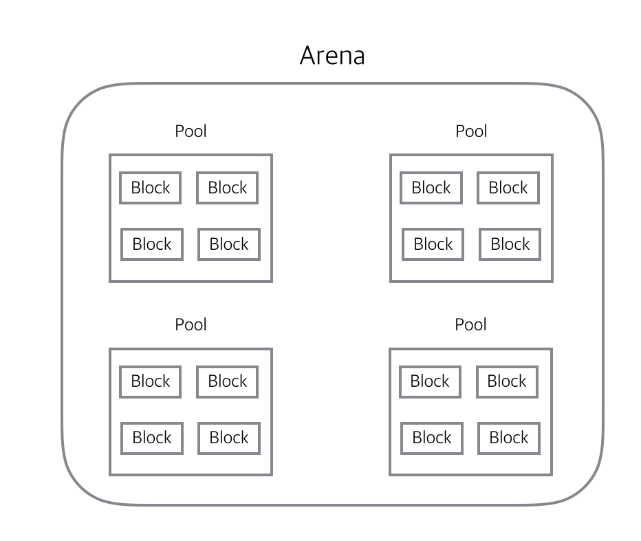

# Наиболее часто встречающиеся требования для Trainee/Junior Python Backend Developer

----
- 📁 [ОБЯЗАТЕЛЬНЫЕ](#-обязательные)
	- 📌 [PythonCore](#-pythoncore)
	- 📌 [Устройство интерпретатора](#-устройство-интерпретатора)
	- 📌 [Принципы написания кода](#-принципы-написания-кода)
	- 📌 [RESTful API / HTTP и HTTPs](#-restful-api-/-http-и-https)
	- 📌 [Django](#-django)
	- 📌 [Django REST](#-django-rest)
	- 📌 [Базы данных](#-базы-данных)
	- 📌 [Docker](#-docker)
- 📁 [БУДЕТ ПЛЮСОМ](#-будет-плюсом)
	- 📌 [Брокеры сообщений](#-брокеры-сообщений)
	- 📌 [Архитектура приложений](#-архитектура-приложений)
	- 📌 [Облачные платформы](#-облачные-платформы)
	- 📌 [СI/CD](#-ci/cd)
---

#      📁 ОБЯЗАТЕЛЬНЫЕ
# 📌 **PythonCore**

1. ### **_Типы данных и их примеры_**
    
2. ### **_Расскажи внутреннее устройство словаря_**
    
3. ### **_Какие проблемы возникают при использовании хеш-таблицы и способы их решения_**
    
4. ### **_Какие типы данных использовала из модуля collection_**
    
    defaultdict, namedtuple, counter
5. ### **_Что такое декоратор?_**
    
6. ### **_Какие декораторы приходилось писать?_**
    
7. ### **_Что такое контекстные менеджеры?_**
    
    Контекстные менеджеры - это объекты, которые позволяют управлять контекстом выполнения определенного кода, предоставляя возможность автоматически выполнять операции при входе в контекст и при выходе из него.
8. ### **_Приходилось ли использовать свои контекстные менеджеры?_**       
	```python
	class MyContextManager:
	    def __enter__(self):
	        # Код, выполняемый при входе в контекст
	        print("Entering the context")
	        # Здесь вы можете выполнить любые операции, которые должны произойти при входе в контекст
	    def __exit__(self, exc_type, exc_value, exc_traceback):
	        # Код, выполняемый при выходе из контекста
	        print("Exiting the context")
	        # Здесь вы можете выполнить любые операции, которые должны произойти при выходе из контекста 
	        # Использование собственного контекстного менеджера
	with MyContextManager():
	    # Здесь находится код, который будет выполняться внутри контекста
	    print("Inside the context")
	```
9. ### **_Для чего используются Лямбда - функции?_**
    
10. ### **_Что такое генераторы и итераторы?_**
    
11. ### **_Как можно создать генератор?_**
    
12. ### **_Как можно создать итератор?_**
    ```python
    class PowTwo:
	    def __init__(self, max=0):
	        self.max = max
	    def __iter__(self):
	        self.n = 0
	        return self
	    def __next__(self):
	        if self.n <= self.max:
	            result = 2 ** self.n
	            self.n += 1
	            return result
	        else:
	            raise StopIteration
	```
13. ### **_Назови десять встроенных функций._**
   
	   - Встроенные функции, выполняющие преобразование типов
	   - abs(x); all(последовательность)
	   - dir([object])
	   - enumerate(iterable, start=0)
	   - filter(function, iterable)
	   - hash(x)
	   - input([prompt]) 
	   - id(object)
	   - isinstance(object, ClassInfo) 
	   - len(x)
	   - iter(x)
14. ### **_Какие принципы ООП ты знаешь в Python?_**
    
15. ### **_Что такое мета-классы?_**
    
16. ### **_Какие стандартные модули приходилось использовать?_**
	
	- `os` — модуль для работы с операционной системой (файлы, папки, пути, переменные среды);
	- `sys` — модуль для работы с интерпретатором Python;
	- `datetime` — модуль для работы с датами и временем;
	- `math` — модуль для выполнения математических операций;
	- `random` — модуль для генерации случайных чисел;
	- `csv` — модуль для работы с файлами CSV;
	- `json` — модуль для работы с данными в формате JSON;
	- `re` — модуль для работы с регулярными выражениями;
	- `urllib` и `requests` — модули для работы с HTTP-запросами;
	- `smtp` — модуль для отправки электронных писем.
---
 
# 📌 **Устройство интерпретатора**

1. ### **_Что такое GIL?_**
    
2. ### **_В чем плюсы и минусы GIL на твой взгляд?_**
    
3. ### **_Как добиться реальной параллельности в Python коде?_**
    
4. ### **_В чем разница асинхронного и многопоточного кода?_**
    
5. ### **_Какие проблемы многопоточности ты знаешь?_**
    
6. ### **_В каких ситуация и что лучше использовать асинхронность, многопоточность и мультипроцессорность?_**
    
7. ### **_Что такое сборщик мусора и как он работает?_**
    
8. ### **_Какие проблемы есть с подсчётом ссылок и как они решаются в питоне?_**
    
9. ### ***Как работает механизм аллоцирования памяти в питоне?***
	
10. ### **_Как происходит процесс удаления из памяти?_**
    
11. ### **_Как работает сборщик мусора в связке GIL?_**
    
---

# 📌 **Принципы написания кода**

1. ### **_SOLID_**
	
	- **S - Single Responsobility (Принцип единой ответсnвености)**
	
		Это когда класс инкапсулирует в себе логику работы только с конкретной и единственной предметной областью.
	
	- **O - Open-Closed (Принцип открытости/закрытости)**
	
		Классы должны  быть  открыты для расширения, но закрыты для модификации. Для добавления нового функционала нельзя изменять старый. То есть новый функционал не должен ломать или заменять старый.
	
	- **L - Liskov Substitution (Принцип подстановки Барбары Лисков)**
	
		Если A родитель класса, а B его наследник, то мы можем заменить во всем коде A на B и ничего не должно поломаться. Из этого следует что класс наследник должен уметь все то же, что и класс родитель.
	
	- **I - Interface Segregation (Принцип разделения интерфейсов)**
	
		Класс должен производить только те операции, которые необходимы для осуществления его функций. 
	
	- **D - Dependency Inversion (Принцип инверсии зависимостей)**
	
		Согласно данному принципу, класс не должен соединяться с инструментом, который применяет для выполнения операции. Вместо этого он должен быть соединён с интерфейсом, который поможет установить связь между инструментом и классом. Интерфейс не должен быть умным.
    
2. ### **_KISS_**
    
3. ### **_DRY_**
    
4. ### **_YAGNI_**
    
---

# 📌 **RESTful API / HTTP и HTTPs**

1. ### **_Что такое http и https и чем они отличаются?_**
    
2. ### **_Модель клиент-серверного общения_**
    
3. ### **_Что такое REST и его принципы?_**
    REST (Representational State Transfer) - это архитектурный стиль, который определяет набор принципов и ограничений для разработки распределенных систем. REST является основой для проектирования веб-служб, API и других систем, обеспечивая простоту, масштабируемость и надежность.
    
	Принципы REST включают в себя:
	
	1) **Клиент-серверная архитектура**
		
		Система разделена на клиентов (инициирующие запросы) и серверы (обеспечивающие ресурсы и обрабатывающие запросы). Это позволяет независимо развивать и масштабировать клиентскую и серверную части системы.
	2) **Без состояния (Stateless)** 
		
		Каждый запрос от клиента к серверу должен содержать всю необходимую информацию для выполнения запроса. Сервер не должен сохранять состояние клиента между запросами. Это упрощает масштабирование системы и повышает ее надежность.
	3) **Кэширование**
		
		Серверы могут указывать клиентам, что определенные ресурсы могут быть кэшированы. Клиенты могут использовать кэшированные данные, если они являются актуальными. Кэширование помогает улучшить производительность и снизить нагрузку на сервер.    
	4) **Единообразие интерфейса**
		
		REST предоставляет унифицированный интерфейс для взаимодействия между клиентом и сервером. Это включает использование стандартных методов HTTP, таких как GET, POST, PUT и DELETE для работы с ресурсами. Кроме того, REST ставит акцент на идентификацию ресурсов через уникальные URI (Uniform Resource Identifiers).
	5) **Слои (Layered System)**
		
		Клиенты могут взаимодействовать с сервером через промежуточные слои, такие как кэши, балансировщики нагрузки или прокси-серверы. Это обеспечивает модульность и упрощает добавление новых функциональных возможностей.
	6) **Код по требованию (Optional)**
		
		Сервер может предоставлять код (например, JavaScript), который выполняется на стороне клиента. Это позволяет клиентам расширять функциональность системы, получая код от сервера.
4. ### **_Какие ты знаешь http методы и за что каждый из них отвечает?_**
    
---

# 📌 **Django**

1. ### **_Какие плюсы и минусы Django ты можешь выделить?_**
    
2. ### **_Что такое ORM и его плюсы и минусы?_**
    
3. ### **_Что такое n+1 проблема и как она решается в Django?_**
    
    Проблема "n+1" (также известная как проблема "1+N") возникает при выполнении запросов к базе данных, когда вместо выполнения единственного запроса для получения данных, необходимых для работы приложения, выполняется дополнительный запрос для каждого элемента (n) в результате первоначального запроса.
	В контексте Django проблема "n+1" часто возникает при использовании отношений ForeignKey или ManyToManyField. Например, если у нас есть модель `Author`, связанная с моделью `Book` через ForeignKey, и мы хотим получить всех авторов и список их книг, неэффективный подход может привести к проблеме "n+1".
	Для решения проблемы "n+1" в Django можно использовать механизм "жадной загрузки" (eager loading), который позволяет получить все необходимые данные в одном запросе. В Django для этого можно использовать метод `select_related` или `prefetch_related` при выполнении запросов.
	В этом примере, используя `select_related('book_set')`, мы выполняем "жадную загрузку" связанных объектов `book_set` вместе с авторами. Теперь все данные получаются в одном запросе, что позволяет избежать проблемы "n+1" и улучшает производительность запросов к базе данных.
	Аналогично, `prefetch_related` можно использовать для решения проблемы "n+1" при работе с ManyToManyField и другими типами связей.
4. ### **_Приходилось ли использовать функции агрегации? Для чего используются методы annotate и  aggregate?_**
	
	Методы `annotate()` и `aggregate()` используются для выполнения агрегаций данных в запросах к базе данных в Django.
	1. **Метод** `annotate()`:
	    - `annotate()` используется для добавления агрегированных значений к каждому объекту в результате запроса.
	    - Он позволяет вычислять агрегированные значения, такие как сумма, среднее, минимум, максимум и т. д., и добавлять их в каждый объект результирующего набора.
	    - Пример:
		```python
			from django.db.models import Sum
			from myapp.models import Order
			orders = Order.objects.annotate(total_price=Sum('price'))
		```
	    - В этом примере, `annotate()` добавляет агрегированное значение `total_price`, которое представляет сумму цен (`price`) всех заказов, к каждому объекту заказа.
	2. **Метод** `aggregate()`:
	    - `aggregate()` используется для вычисления агрегированных значений по всем объектам в результате запроса.
	    - Он позволяет вычислять агрегированные значения и возвращать их в виде отдельного результата запроса.
	    - Пример:
			```python
			from django.db.models import Avg
			from myapp.models import Product
			avg_rating = Product.objects.aggregate(average_rating=Avg('rating'))
			```
	    - В этом примере, `aggregate()` вычисляет среднюю оценку (`rating`) всех продуктов и возвращает ее в виде результата запроса.
	Использование методов `annotate()` и `aggregate()` позволяет проводить агрегации данных в запросах к базе данных, что полезно, когда требуется получить суммарные, средние или другие агрегированные значения на основе данных в моделях Django.
5. ### **_Приходилось ли использовать Q и F выражения?_**
    1) **Выражение Q**:
        - Выражение Q (Query) позволяет создавать сложные условия для фильтрации объектов в запросах к базе данных.
        - Он используется для объединения нескольких условий с использованием логических операторов И (`&`), ИЛИ (`|`) и НЕ (`~`).
        - `Q` может быть использован как аргумент в методах `filter()`, `exclude()` и других методах запросов.
        - Пример:
			```python
				from django.db.models import Q
				from myapp.models import Product
				products = Product.objects.filter(Q(price__lt=100) | Q(name__icontains='apple'))
			```
			
        - В этом примере, `filter()` использует выражение `Q`, чтобы получить все продукты с ценой меньше 100 или содержащие в имени слово "apple".

    2) **Выражение F**:
	    - Выражение F (Field) позволяет использовать значения полей модели внутри запросов, в том числе для сравнения, математических операций и обновления значений полей.
	    - Он позволяет работать с полями модели непосредственно на уровне базы данных, вместо извлечения их в Python для дальнейшей обработки.
	    - `F` может использоваться в методах `filter()`, `update()` и других методах запросов.
	    - Пример:
			```python
			from django.db.models import F
			from myapp.models import Product
			products = Product.objects.filter(price__gt=F('discounted_price'))
			```
	    - В этом примере, `filter()` использует выражение `F`, чтобы получить все продукты, у которых цена (`price`) больше, чем скидочная цена (`discounted_price`).
	
	Использование Q- и F-выражений позволяет создавать более сложные и гибкие запросы к базе данных в Django, включая условия с использованием логических операторов и работу с значениями полей модели. Это особенно полезно, когда требуется построить запросы с динамически определяемыми условиями или использовать значения полей модели внутри запросов.
6. ### **_Как сделать GROUP BY с помощью Django ORM?_**
	
	В Django ORM для выполнения операции GROUP BY можно использовать метод `values()` в сочетании с методом `annotate()`. Вот примеры использования:
	1) **Простой GROUP BY**:
		```python
		from django.db.models import Count
		from myapp.models import Product
		# Выбираем все продукты и группируем их по полю 'category'
		grouped_products = Product.objects.values('category').annotate(total=Count('id'))
		```
		В этом примере мы выбираем все продукты и группируем их по полю 'category'. Метод `values('category')` указывает, что мы хотим группировать по полю 'category'. Затем мы используем метод `annotate(total=Count('id'))`, чтобы добавить агрегированное значение 'total', которое представляет количество продуктов в каждой группе.
	2) **GROUP BY с условием WHERE**:
		```python
		from django.db.models import Count
		from myapp.models import Product
		# Выбираем все продукты с ценой больше 100 и группируем их по полю 'category'
		grouped_products = Product.objects.filter(price__gt=100).values('category').annotate(total=Count('id'))
		```
		В этом примере мы выбираем только те продукты, у которых цена больше 100, и группируем их по полю 'category'. Затем мы используем метод `annotate(total=Count('id'))`, чтобы добавить агрегированное значение 'total' - количество продуктов в каждой группе.
		
		Метод `values()` указывает, по каким полям нужно группировать объекты, а метод `annotate()` позволяет добавлять агрегированные значения к каждой группе. В приведенных примерах мы использовали функцию `Count('id')` для подсчета количества объектов в каждой группе, но вы также можете использовать другие функции агрегации, такие как `Sum`, `Avg`, `Max` и т. д.
		
		Таким образом, с помощью методов `values()` и `annotate()` вы можете выполнять операции GROUP BY в Django ORM и получать результаты агрегации данных по определенным полям.
7. ### **_В чем различие метода filter и exclude?_**
	
	Методы `filter()` и `exclude()` являются частями Django ORM и используются для фильтрации объектов в запросах к базе данных. Вот различия между ними:
	1) **Метод** `filter()`:
	    - `filter()` используется для определения условий, которым должны удовлетворять объекты, чтобы быть включенными в результирующий набор.
	    - Он выбирает объекты, которые соответствуют заданным условиям фильтрации.
	    - Пример:
			```python
			from myapp.models import Product
			# Выбрать все продукты с ценой больше 100
			products = Product.objects.filter(price__gt=100)
			```
	    - В этом примере, `filter()` выбирает все продукты, у которых цена (`price`)  больше 100.
	2) **Метод** `exclude()`:
	    - `exclude()` используется для исключения объектов, которые соответствуют заданным условиям, из результирующего набора.
	    - Он исключает объекты, которые удовлетворяют указанным условиям.
	    - Пример:
			```python
			from myapp.models import Product
			# Исключить все продукты с ценой меньше или равной 50
			products = Product.objects.exclude(price__lte=50)
			```
	    - В этом примере, `exclude()` исключает все продукты, у которых цена (`price`) меньше или равна 50.
	Используя `filter()` и `exclude()`, вы можете создавать более сложные запросы, комбинируя различные условия с помощью логических операторов (И, ИЛИ, НЕ). Если вы хотите выбрать объекты, которые удовлетворяют определенным условиям, используйте `filter()`. Если вы хотите исключить объекты, соответствующие заданным условиям, используйте `exclude()`.
8. ### **_Является ли класс мета в Django метаклассом?_**
	
	Нет, класс `Meta` в Django не является метаклассом. Класс `Meta` - это внутренний класс, используемый в моделях Django для предоставления метаданных о модели.
---

# 📌 **Django REST**

1. ### **_Какие вьюшки ты используешь?_**
	1) **APIView** 
		
		Это базовый класс представления, который предоставляет самый простой способ создания API-представлений в DRF. Я использую `APIView`, когда требуется полный контроль над обработкой запросов и не требуется автоматическое преобразование данных запроса и ответа.
	2) **GenericAPIView** 
		
		Это класс представления, который предоставляет расширенные функции для работы с моделями Django и автоматического преобразования данных запроса и ответа. Я использую `GenericAPIView` в ситуациях, когда нужно создать API-представление для одной модели и требуется стандартные операции CRUD (создание, чтение, обновление, удаление).
	3) **ViewSet** 
		
		Виды представлений (views) из класса `ViewSet` предоставляют ещё более удобный способ создания API-представлений, комбинируя различные операции CRUD в одном классе представления. Я использую `ViewSet`, когда нужно создать API-представления, которые обрабатывают различные операции, такие как получение списка объектов, создание объекта, получение конкретного объекта, обновление объекта и удаление объекта.
	4) **ModelViewSet** 
		
		Это класс представления, который предоставляет полную функциональность CRUD для модели Django в одном классе представления. `ModelViewSet` объединяет операции чтения, создания, обновления и удаления объектов в одном классе представления. Я использую `ModelViewSet`, когда нужно создать API-представление для модели Django, и требуется полная функциональность CRUD.
2. ### **_Какие плюсы использования вьюх написанных на классах?_**
	1) **Многоразовость кода**
		
		Классы представлений позволяют создавать модульные и многоразовые компоненты кода. Вы можете создать базовый класс представления с общей логикой и наследовать его для создания конкретных представлений. Это способствует повторному использованию кода и упрощает его поддержку и изменение.
	2) **Стандартизация операций**
		
		Классы представлений в DRF предоставляют стандартные методы для выполнения различных операций, таких как получение списка объектов, создание нового объекта, обновление объекта и удаление объекта. Это способствует единообразию и стандартизации вашего API.
	3) **Разделение логики**
		
		Классы представлений позволяют явно разделить различные аспекты логики, такие как обработка запросов, сериализация данных, валидация данных, авторизация и другие. Каждый аспект логики может быть реализован в отдельных методах класса представления, что облегчает понимание и поддержку кода.
	4) **Расширяемость и настраиваемость**
		
		Классы представлений позволяют легко настраивать и расширять их функциональность. Вы можете добавлять свои собственные методы и переопределять стандартные методы, чтобы адаптировать поведение представления под ваши требования. Это дает большую гибкость и контроль над вашими представлениями.
	5) **Поддержка mixins**
		
		В Django REST Framework есть множество готовых mixins - наборов поведения, которые можно легко добавлять к классам представлений. Это позволяет вам использовать предопределенные функции, такие как пагинация, фильтрация, сортировка, аутентификация и другие, просто добавляя соответствующие mixins к вашему классу представления.
	6) **Улучшенная читаемость и понимание**
		
		Классы представлений в DRF обычно имеют явную структуру и именование методов, что делает код более читаемым и понятным. Это особенно полезно при работе с более сложными операциями и логикой.
3. ### **_Что такое сериализаторы? Для чего они используются?_**
	
	Сериализаторы в Django REST Framework (DRF) - это компоненты, которые позволяют преобразовывать сложные типы данных, такие как модели Django, в форматы, которые легко передавать через сеть, такие как JSON. Они также обеспечивают обратное преобразование, то есть преобразование данных из формата, полученного от клиента, в объекты моделей.
---

# 📌 **Базы данных**

1. ### **_Какие типы баз данных ты знаешь? И чем они отличаются?_**
    
2. ### **_Какие плюсы PostgreSQL ты можешь выделить?_**
	
	PostgreSQL - мощная объектно-реляционная система управления базами данных (СУБД) с открытым исходным кодом. Вот некоторые плюсы, которые можно выделить при использовании PostgreSQL:
	1) **Надежность и целостность данных**
		
		PostgreSQL обеспечивает высокую надежность и целостность данных. Он поддерживает транзакции с ACID-свойствами (атомарность, согласованность, изолированность и долговечность), что гарантирует согласованность и безопасность ваших данных.
	2) **Расширяемость и гибкость**
		
		PostgreSQL предлагает множество возможностей для расширения функциональности базы данных. Он поддерживает создание пользовательских типов данных, пользовательских функций, хранимых процедур и других расширений. Это позволяет адаптировать СУБД под специфические потребности проекта.
	3) **Мощный язык запросов**
		
		PostgreSQL предоставляет мощный язык запросов, который поддерживает сложные запросы, агрегацию, оконные функции, CTE (общие таблицы выражений) и другие продвинутые возможности. Это позволяет эффективно извлекать и манипулировать данными из базы данных.
	4) **Поддержка геопространственных данных**
		
		PostgreSQL имеет встроенную поддержку геопространственных данных, что делает его отличным выбором для разработки географических приложений. Он предоставляет функции для работы с геометрическими объектами, выполнения пространственных запросов и анализа геоданных.
	5) **Масштабируемость**
		
		PostgreSQL может эффективно масштабироваться как по вертикали, добавляя более мощное оборудование, так и по горизонтали, с использованием репликации и шардинга данных. Это позволяет поддерживать высокую производительность и обработку большого объема данных.
	6) **Богатый набор функций**
		
		PostgreSQL предлагает богатый набор встроенных функций и типов данных, включая поддержку полнотекстового поиска, индексирование, аналитические функции, работу с массивами и JSON-данными, шифрование данных и многое другое. Это упрощает разработку сложных приложений и обработку различных типов данных.
	7) **Активное сообщество и поддержка**
3. ### **_Что такое индексы? И какие индексы ты знаешь?_**
    
    Индексы в контексте баз данных являются структурами данных, создаваемыми для ускорения поиска и извлечения данных из таблиц. Индексы обеспечивают быстрый доступ к данным, подобно алфавитному указателю в книге, где можно быстро найти страницу с нужной информацией.
    
	Некоторые известные типы индексов в базах данных:
	
	1) **B-деревья (B-trees)**
		
		B-деревья являются одной из самых распространенных структур индексов. Они обеспечивают эффективный поиск по ключам и хранятся в виде сбалансированного дерева. B-деревья подходят для широкого спектра операций поиска, таких как точное совпадение, диапазонные запросы и сортировка. 
	2) **Хеш-индексы (Hash indexes)**
		
		Хеш-индексы используют хеш-функции для быстрого поиска по значению ключа. Они обычно обеспечивают очень быстрый доступ к данным, но имеют ограничения в виде поддержки только точных совпадений и отсутствия поддержки диапазонных запросов.
	3. **GiST (Generalized Search Tree)**
		
		GiST - это общая структура данных для индексации, которая поддерживает различные типы поиска, включая геопространственные данные и текстовый поиск. Он предоставляет гибкую модель индексации, позволяя определять пользовательские операции и типы данных.
	4) **GIN (Generalized Inverted Index)**
		
		GIN - это структура индекса, специализированная на обработку поисковых запросов с полнотекстовым поиском и индексацией массивов. Она обеспечивает быстрый поиск по ключевым словам и поддерживает различные операции с массивами.
	5) **BRIN (Block Range INdex)**
		
		BRIN - это индекс, который разбивает данные на блоки и хранит сжатую информацию о минимальном и максимальном значении в каждом блоке. Он эффективно работает с большими таблицами, где данные упорядочены по ключу.
4. ### **_Какие join-ы ты знаешь? И расскажи про каждый из них поподробнее_**
    
    В SQL существует несколько типов операций объединения (join), которые позволяют объединять данные из нескольких таблиц на основе определенного условия. 
    
    Вот некоторые из наиболее распространенных типов join:
    
	1) **INNER JOIN**
		
		INNER JOIN возвращает только те строки, которые имеют совпадающие значения в объединяемых таблицах. Он использует условие сравнения для определения совпадений между таблицами и возвращает результат, содержащий только строки, удовлетворяющие этому условию. Пример использования INNER JOIN:
	    ```SQL
		SELECT Orders.OrderID, Customers.CustomerName
	    FROM Orders
	    INNER JOIN Customers ON Orders.CustomerID = Customers.CustomerID;
	    ```
	2) **LEFT JOIN**
		
		LEFT JOIN возвращает все строки из левой (первой) таблицы и соответствующие строки из правой (второй) таблицы. Если нет совпадений в правой таблице, то для соответствующих столбцов будет использовано значение NULL. Пример использования LEFT JOIN:
	    ```SQL
		SELECT Customers.CustomerName, Orders.OrderID
	    FROM Customers
	    LEFT JOIN Orders ON Customers.CustomerID = Orders.CustomerID;
	    ```
	3) **RIGHT JOIN**
		
		RIGHT JOIN возвращает все строки из правой (второй) таблицы и соответствующие строки из левой (первой) таблицы. Если нет совпадений в левой таблице, то для соответствующих столбцов будет использовано значение NULL. Пример использования RIGHT JOIN:
		```SQL
		SELECT Customers.CustomerName, Orders.OrderID
	    FROM Customers
	    RIGHT JOIN Orders ON Customers.CustomerID = Orders.CustomerID;
	    ```
	4) **FULL JOIN**
		
		FULL JOIN объединяет результаты LEFT JOIN и RIGHT JOIN и возвращает все строки из обеих таблиц. Если нет совпадений в одной из таблиц, то для соответствующих столбцов будет использовано значение NULL. Пример использования FULL JOIN:    
	   ```SQL
		SELECT Customers.CustomerName, Orders.OrderID
	    FROM Customers
	    FULL JOIN Orders ON Customers.CustomerID = Orders.CustomerID;
	    ```
	5) **CROSS JOIN**
		
		CROSS JOIN выполняет декартово произведение двух таблиц, то есть возвращает все возможные комбинации строк из обеих таблиц. Результатом является таблица, которая содержит все возможные комбинации строк. Пример использования CROSS JOIN:
	    ```SQL
	    SELECT Customers.CustomerName, Orders.OrderID
	    FROM Customers
	    CROSS JOIN Orders;
	    ```
	Это лишь некоторые из типов join, доступных в SQL. Каждый тип join предоставляет разные способы объединения данных из разных таблиц и позволяет выполнять различные операции с объединенными результатами. Выбор подходящего типа join зависит от требуемого результата и логики запроса.
5. ### **_Какие виды связи бывают между таблицами? И как они реализуются на уровне баз данных?_**
    
    На уровне баз данных, связи между таблицами обычно реализуются с помощью ключей, которые связывают значения одной таблицы с другой. Существуют различные типы связей, которые могут быть использованы в базах данных, включая:
	1) **Один к одному (One-to-One)**
		
		Это тип связи, при котором каждая запись в одной таблице связана с одной записью в другой таблице. Для реализации такой связи, обычно используется внешний ключ в одной из таблиц.  
	2) **Один ко многим (One-to-Many)**
		
		В этом типе связи каждая запись в одной таблице может быть связана с несколькими записями в другой таблице. Обычно внешний ключ добавляется в таблицу "многие" для указания на связанную запись в таблице "один".
	3) **Многие ко многим (Many-to-Many)**
		
		Это тип связи, при котором каждая запись в одной таблице может быть связана с несколькими записями в другой таблице, и наоборот. Для реализации такой связи создается третья таблица, называемая "таблицей-связью" или "промежуточной таблицей", которая содержит ключи обеих таблиц.
6. ### **_Что такое PrimaryKey?_**
	
	PrimaryKey (переводится как "первичный ключ") - это уникальный идентификатор, используемый для однозначной идентификации каждой записи в таблице базы данных. Он служит основным ключом для определения уникальности записей и обеспечивает быстрый доступ к данным. Основные характеристики PrimaryKey:
	
	1) **Уникальность**
		
		Каждое значение первичного ключа должно быть уникальным в пределах таблицы. Ни одно две записи не могут иметь одинаковое значение первичного ключа.
	2) **Неизменяемость**
		
		Значение первичного ключа не должно изменяться после его создания. Это гарантирует стабильность и однозначность идентификации записей.
	3) **Неотсутствие**
		
		Значение первичного ключа не может быть NULL или отсутствовать. Каждая запись в таблице должна иметь первичный ключ.
7. ### **_Constraints в базах данных?_**
    
    В контексте баз данных, ограничения (constraints) представляют собой правила, накладываемые на данные в таблице, чтобы гарантировать их целостность и согласованность. Constraints определяют различные ограничения и требования, которые должны быть соблюдены при добавлении, изменении или удалении данных. Ниже приведены некоторые распространенные типы ограничений, используемых в базах данных:
    
	1) **Primary Key Constraint (ограничение первичного ключа)**
		
		Определяет поле или набор полей, которые должны содержать уникальные идентификаторы для каждой записи в таблице. Primary key constraint обеспечивает уникальность идентификации записей и облегчает ссылочную целостность.    
	2) **Foreign Key Constraint (ограничение внешнего ключа)**
		
		Определяет связь между двумя таблицами на основе значения первичного ключа в одной таблице и соответствующего значения внешнего ключа в другой таблице. Foreign key constraint обеспечивает ссылочную целостность и поддерживает связи между таблицами.
	3) **Unique Constraint (ограничение уникальности)**
		
		Гарантирует, что значения в указанном поле или наборе полей являются уникальными для каждой записи в таблице. Unique constraint предотвращает дублирование данных и обеспечивает целостность данных.
	4) **Not Null Constraint (ограничение на непустое значение)** 
		
		Указывает, что определенное поле не может содержать значение NULL. Not null constraint требует, чтобы в поле было указано некоторое значение, предотвращая отсутствие необходимых данных.
	5) **Check Constraint (ограничение проверки)** 
		
		Позволяет определить пользовательское условие или выражение, которое должно быть истинным для каждой записи в таблице. Check constraint используется для проверки и ограничения допустимых значений или условий для полей.
8. ### **_Назови принципы ACID._**
    
    Принципы ACID - это набор основных принципов, которые определяют требования к транзакциям в базах данных. Акроним ACID расшифровывается следующим образом:
    
	1) **Atomicity (Атомарность)** 
		
		Транзакция должна быть атомарной, что означает, что она должна рассматриваться как единая неделимая операция. Все операции внутри транзакции должны быть выполнены полностью или не выполнены совсем. Если хотя бы одна операция внутри транзакции не может быть выполнена, то все изменения должны быть отменены (откат), чтобы вернуть базу данных в исходное состояние.
	2) **Consistency (Согласованность)** 
		
		Транзакция должна сохранять согласованность базы данных. Это означает, что после выполнения транзакции база данных должна оставаться в согласованном состоянии, соответствующем определенным правилам и ограничениям целостности данных.    
	3) **Isolation (Изолированность)** 
		
		Транзакции должны выполняться в изолированном режиме, то есть результаты одной транзакции не должны влиять на результаты других транзакций, выполняющихся параллельно. Изоляция обеспечивает, что каждая транзакция работает с данными, как будто она выполняется в отдельном изолированном пространстве.    
	4) **Durability (Долговечность)** 
		
		Результаты выполненной транзакции должны быть долговечными и сохранены в базе данных, даже в случае сбоев или отключения системы. Это означает, что данные, которые были успешно записаны в базу данных, должны оставаться доступными и не должны быть утрачены.
9. ### **_Расскажи про CAP теорему._**
    
    Теорема CAP (Consistency, Availability, Partition tolerance) - это теорема, описывающая ограничения, которые существуют при проектировании распределенных систем. Теорема CAP утверждает, что в условиях распределенной системы невозможно одновременно обеспечить все три свойства: согласованность (Consistency), доступность (Availability) и устойчивость к разделению (Partition tolerance).
    
	1) **Consistency (Согласованность)**
		
		Согласованность означает, что все копии данных в распределенной системе всегда находятся в согласованном состоянии. Это означает, что любое чтение данных из системы будет возвращать последнюю записанную версию данных или последнее обновление данных. При достижении согласованности система должна удовлетворять определенным правилам и ограничениям целостности данных.    
	2) **Availability (Доступность)**
		
		Доступность означает, что каждый запрос к распределенной системе должен получить ответ о результатах операции. Система должна быть доступна и готова обрабатывать запросы, даже в случае возникновения отказов или сбоев в системе. Доступность обеспечивает непрерывность работы системы и отказоустойчивость.    
	3) **Partition Tolerance (Устойчивость к разделению)**
		
		Устойчивость к разделению означает, что система продолжает функционировать, даже если возникают сетевые разделения (partitions) между узлами распределенной системы. Разделение может происходить в результате сбоев сети или задержек. Устойчивость к разделению позволяет системе продолжать работу и обеспечивает ее надежность.
10. ### **_Что такое нормализация и денормализация баз данных?_**
    
    Нормализация и денормализация - это два противоположных подхода к организации структуры базы данных.
    
	Нормализация - это процесс разделения данных в базе данных на отдельные таблицы с целью устранения избыточности данных и обеспечения целостности. Нормализация основана на наборе нормальных форм (например, первая нормальная форма (1NF), вторая нормальная форма (2NF), третья нормальная форма (3NF) и т.д.), которые определяют правила для устранения избыточности и повышения организации данных. Чем выше нормальная форма, тем больше требований предъявляется к структуре данных.
	
	Преимущества нормализации включают устранение избыточности, более легкое обновление и поддержку данных, а также лучшую защиту от аномалий и противоречий в данных. Однако, нормализация может привести к сложным запросам и объединениям таблиц для извлечения связанных данных.
	
	Денормализация - это процесс объединения таблиц или добавления избыточных данных в таблицы с целью увеличения производительности и упрощения запросов. Денормализация может использоваться в случаях, когда требуется быстрый доступ к данным или когда запросы часто объединяют несколько таблиц. При денормализации данные дублируются или комбинируются в одной таблице, чтобы избежать сложных операций объединения.
	
	Преимущества денормализации включают улучшенную производительность запросов, упрощенные запросы и снижение количества таблиц. Однако, денормализация может привести к избыточности данных, увеличению размера базы данных и потенциальным проблемам с целостностью данных при обновлении или изменении данных.
11. ### **_Назови уровни нормализации баз данных._**
    
	1) **Первая нормальная форма (1NF)** 
		
		Она требует, чтобы каждая ячейка в таблице содержала только одно значение, и каждая колонка имела уникальное имя. Также все значения в столбцах должны быть атомарными (неделимыми).
	2) **Вторая нормальная форма (2NF)**
		
		Вторая нормальная форма строится на основе 1NF и добавляет дополнительные требования. Она гарантирует, что каждый неключевой атрибут (столбец) в таблице полностью зависит от первичного ключа. То есть каждый неключевой атрибут должен зависеть только от первичного ключа, а не от других неключевых атрибутов.
	3) **Третья нормальная форма (3NF)**
		
		Третья нормальная форма строится на основе 2NF и дополнительно требует, чтобы каждый неключевой атрибут не зависел от других неключевых атрибутов. Она гарантирует, что нет транзитивных зависимостей между неключевыми атрибутами.
12. ### **_Какие уровни нормализации используются в PostgreSQL и какие в MySQL?_**
    
13. ### **_Проверить уровень знания SQL синтаксиса._**
    
14. ### **_Проверить уровень знания нереляционного синтаксиса._**
    
15. ### **_Какие нереляционные базы данных ты использовал? И в каких целях?_**
    
16. ### **_В каком формате данные хранятся в MongoDB и Redis?_**
    
17. ### **_Какие различия между MongoDB и Redis?_**
    
---

# 📌 **Docker**

1. ### ***Приходилось ли работать с Docker?***
    
    Docker - это открытая платформа, которая позволяет автоматизировать развертывание, масштабирование и управление приложениями в контейнерах. Контейнеры Docker представляют собой изолированные и портативные среды, в которых можно запускать приложения и их зависимости без проблем совместимости или конфликтов.
2. ### ***Что такое** **volume?***
    
    Volume (том) в Docker - это механизм, позволяющий сохранять и подключать данные к контейнерам. Он позволяет создавать постоянное хранилище данных в Docker-контейнере, которое может быть использовано как для чтения, так и для записи данных. В отличие от файлов, созданных в контейнере, данные в томах сохраняются и доступны, даже если контейнер удален или перезапущен.
3. ### ***Что такое** **layer?***
    
    В контексте Docker, слой (layer) - это концепция, используемая для организации файловой системы внутри образа контейнера. Образ контейнера состоит из набора слоев, где каждый слой представляет собой изменения, внесенные в файловую систему по сравнению с предыдущим слоем.
    
    Каждый слой содержит только изменения, сделанные относительно предыдущего слоя, и хранит только файлы и директории, которые были добавлены, изменены или удалены. Это делает слои контейнера легковесными и эффективными с точки зрения использования дискового пространства.
4. ### ***Что такое networks в Docker Compose?***
    
    В Docker Compose секция "networks" используется для определения пользовательских сетей (networks) в многоконтейнерной среде. С помощью этой секции можно создавать и настраивать сетевые окружения для ваших сервисов, объединяя контейнеры внутри определенных сетей и определяя свойства сетевого взаимодействия между ними.
    
    Секция "networks" в Docker Compose позволяет определить несколько сетей и связать сервисы с определенными сетевыми окружениями. Каждая сеть имеет свое имя, которое вы указываете в конфигурации сервиса. Когда контейнеры запускаются с использованием Docker Compose, они автоматически подключаются к указанным сетям.
    
    Использование сетей в Docker Compose предоставляет ряд преимуществ:
    
	1) **Изоляция сетей**
		
		Контейнеры, подключенные к разным сетям, могут быть изолированы друг от друга, что обеспечивает безопасность и разделение ресурсов.
	2) **Горизонтальное масштабирование**
		
		Сервисы, объединенные в одну сеть, могут легко масштабироваться путем добавления или удаления экземпляров контейнеров.
	3) **Чистота конфигурации**
		
		Определение сетей в Docker Compose позволяет явно указывать, какие контейнеры должны взаимодействовать между собой, что делает конфигурацию более понятной и управляемой.
	4) **Управление связями**
		
		Сети позволяют легко управлять связями между сервисами и контролировать, какие сервисы могут общаться друг с другом.
---  

#      📁 БУДЕТ ПЛЮСОМ
# 📌 **Брокеры сообщений**

1. ### **_Приходилось ли использовать брокеры сообщений? И если да, то какие?_**
    
2. ### **_Внутреннее устройство RabbitMQ?_**
    
    RabbitMQ - это брокер сообщений, который реализует протокол AMQP (Advanced Message Queuing Protocol) и используется для обмена сообщениями между различными компонентами приложения. Вот краткое описание внутреннего устройства RabbitMQ:

	1) **Virtual Hosts (виртуальные хосты)**
	 
		RabbitMQ поддерживает концепцию виртуальных хостов, которые позволяют разделить брокер на несколько изолированных сред для разных приложений или пользователей.
	2) **Exchanges (обмены)**
	 
		Сообщения отправляются в RabbitMQ через обмены. Обмены получают сообщения от производителей и маршрутизируют их в очереди с помощью определенных правил. RabbitMQ предоставляет различные типы обменов, такие как прямой обмен, фанаут (fanout) обмен, тематический обмен и др., которые определяют логику маршрутизации сообщений.
	3) **Queues (очереди)**
	 
		Очереди являются местом хранения сообщений, которые ожидают обработки. Когда сообщение поступает в очередь, оно сохраняется до тех пор, пока не будет получено или доставлено подписчику (потребителю). Очереди в RabbitMQ могут быть долговременными или временными. Долговременные очереди сохраняются на диске и переживают перезапуск брокера, в то время как временные очереди удаляются после отключения подписчика.
	4) **Bindings (связи)**
	 
		Связи определяют связь между обменами и очередями. Они определяют, как сообщения из обмена маршрутизируются в определенную очередь. Связи содержат информацию о правилах маршрутизации, таких как ключи маршрутизации (routing keys) или шаблоны.
	5) **Consumers (потребители)**
	 
		Потребители (или подписчики) являются компонентами, которые принимают сообщения из очередей и обрабатывают их. Они могут быть реализованы в виде отдельных процессов или приложений, которые подключаются к брокеру и слушают определенные очереди на предмет новых сообщений.
	6) **Publishers (производители)**
	 
		Производители - это компоненты, которые отправляют сообщения в RabbitMQ через обмены. Они определяют маршрутизацию сообщений и указывают, в какой обмен и с каким ключом маршрутизации следует отправить сообщение.
	7) **Архитектура взаимодействия**
	 
		Когда производитель отправляет сообщение, оно направляется в обмен, а затем маршрутизируется в одну или несколько очередей через связи. Потребители могут подписываться на очереди и получать сообщения для обработки.
    
	Внутреннее устройство RabbitMQ основано на модели "издатель-подписчик" и обеспечивает надежную доставку сообщений, очередность обработки и управление подписками на основе различных правил маршрутизации.
3. ### **_Внутреннее устройство Kafka?_**
    
    Apache Kafka - это распределенная платформа обработки данных и потоковых сообщений. Она предоставляет высокую пропускную способность, масштабируемость и устойчивость к отказам. Вот основные компоненты и принципы внутреннего устройства Kafka:

	1) **Топики (Topics)**
	 
		Топик представляет собой категорию или канал, куда производитель (publisher) отправляет поток сообщений. Топик разделен на несколько партиций (partitions), каждая из которых содержит упорядоченную и неизменяемую последовательность сообщений. Каждое сообщение в топике имеет уникальный смещение (offset), которое идентифицирует его положение в партиции.
	2) **Брокеры (Brokers)**
	 
		Брокеры представляют собой узлы в кластере Kafka, которые хранят и обрабатывают потоки данных. Каждый брокер является независимым сервером и может обслуживать одну или несколько партиций топиков. Брокеры отслеживают смещения сообщений и поддерживают репликацию данных для обеспечения отказоустойчивости.    
	3) **Потребители (Consumers)**
	 
		Потребители - это приложения или компоненты, которые считывают и обрабатывают потоки сообщений из топиков. Каждый потребитель может читать данные с одной или нескольких партиций. Потребители могут читать сообщения в реальном времени или периодически, и каждый потребитель отслеживает свое собственное смещение (offset) в партиции для обеспечения последовательности чтения.
	    
	4) **Производители (Producers)**
	 
		Производители - это приложения или компоненты, которые отправляют потоки сообщений в топики. Они записывают сообщения в определенные партиции и могут выбирать стратегию разделения данных между партициями. Производители также отслеживают подтверждения о записи и могут повторно отправлять сообщения при неудачной доставке.
	5) **Группы потребителей (Consumer Groups)**
	 
		Группа потребителей представляет собой коллекцию потребителей, которые читают сообщения из одного или нескольких топиков. Каждая партиция в топике может быть прочитана только одним потребителем из группы, что позволяет достичь параллельной обработки сообщений. Каждый потребитель в группе отслеживает свое смещение чтения в партиции, и приложения могут гибко масштабироваться, добавляя или удаляя потребителей в группе.    
	6) **Хранение данных (Storage)**
	 
		Kafka сохраняет сообщения на диске в партициях с определенным сроком хранения. Это позволяет обеспечить устойчивость к отказам и возможность повторного чтения сообщений. Когда сообщения исчерпывают срок хранения, они удаляются из партиций.
	7) **Управление и репликация (Management and Replication)**
	 
		Kafka имеет механизм управления топиками, партициями, брокерами и группами потребителей. Он также поддерживает репликацию данных, что позволяет брокерам восстановиться при отказе и обеспечивает избыточность данных.

	Apache Kafka обеспечивает надежную и масштабируемую платформу для обработки и потоковой обработки данных, позволяя приложениям обмениваться сообщениями в реальном времени и строить высокопроизводительные системы обработки потоков данных.
4. ### **_Какие различия RabbitMQ и Kafka ты знаешь?_**
    
    RabbitMQ и Apache Kafka являются двумя популярными распределенными системами обработки сообщений и потоковых данных, но они имеют несколько ключевых различий:

	1) **Модель сообщений**
	 
		RabbitMQ основан на модели "издатель-подписчик" и точка-точка (publish-subscribe and point-to-point), в то время как Kafka основан на модели журналов изменений (логовых файлов) и публикации-подписки.    
	2) **Сохранение сообщений**
	 
		RabbitMQ сохраняет сообщения на диске в очередях, что позволяет им быть сохраненными до тех пор, пока они не будут обработаны. В Kafka сообщения сохраняются в логах изменений с ограниченным временем хранения и смещениями чтения.
	3) **Пропускная способность**
	 
		Kafka изначально разработан для высокой пропускной способности и обработки потоков данных в режиме реального времени. Он может обрабатывать миллионы сообщений в секунду и обеспечивает горизонтальное масштабирование. RabbitMQ обычно имеет более низкую пропускную способность, но обеспечивает более низкую задержку доставки сообщений.
	4) **Хранение сообщений**
	 
		RabbitMQ сохраняет сообщения в памяти и/или на диске, в то время как Kafka хранит сообщения на диске и оптимизирован для обработки больших объемов данных.    
	5) **Устойчивость к отказам**
	 
		RabbitMQ обеспечивает гарантированную доставку сообщений и обработку ошибок с помощью подтверждений и механизмов перенаправления. Kafka обеспечивает устойчивость к отказам с помощью репликации и сохранения смещений чтения.    
	6) **Семантика обработки**
 
		RabbitMQ гарантирует, что каждое сообщение будет доставлено только одному потребителю (если используется точка-точка) или всем подписчикам (если используется публикация-подписка). Kafka гарантирует сохранение порядка сообщений в пределах партиции, но не гарантирует порядок обработки сообщений между разными партициями.
	
	Выбор между RabbitMQ и Kafka зависит от требований конкретного сценария использования. RabbitMQ обычно используется для очередей задач, обработки сообщений с гарантированной доставкой и точно-точечной коммуникации. Kafka часто используется для обработки потоков данных в реальном времени, анализа данных, стриминга и событийной обработки.
---

# 📌 **Архитектура приложений**

1. ### **_Какие архитектуры приложений ты знаешь?_**

	1) **Монолитная архитектура** 
	 
		В монолитной архитектуре все компоненты приложения развернуты на одной платформе и взаимодействуют друг с другом напрямую. Весь код, базы данных и пользовательский интерфейс находятся в одном приложении. Это простая архитектура, но может стать сложной для масштабирования и поддержки при росте приложения.
	2) **Клиент-серверная архитектура**
	 
		Клиент-серверная архитектура состоит из клиентских устройств (клиентов), которые запрашивают данные или услуги, и серверов, которые предоставляют эти данные или услуги. Взаимодействие происходит по сети с использованием протоколов, таких как HTTP. Эта архитектура позволяет легко масштабировать и распределить нагрузку между серверами.
	3) **Микросервисная архитектура**
	 
		В микросервисной архитектуре приложение разделено на небольшие и независимые сервисы, которые могут быть развернуты и масштабированы отдельно. Каждый сервис выполняет определенные функции и общается с другими сервисами через сетевые вызовы или сообщения. Микросервисная архитектура позволяет легко масштабировать и развивать отдельные компоненты приложения, но требует управления сетевым взаимодействием и повышенного внимания к безопасности.
	4) **Событийно-ориентированная архитектура**
	 
		В событийно-ориентированной архитектуре компоненты приложения взаимодействуют через события, которые могут быть опубликованы, подписаны и обработаны. Это позволяет асинхронную и легкую интеграцию между разными компонентами приложения. Событийно-ориентированная архитектура обеспечивает гибкость, реактивность и легкую масштабируемость, особенно при работе с большими объемами данных.
	5) **Serverless-архитектура**
	 
		В Serverless-архитектуре разработчики сосредоточены на написании кода функций, которые выполняют определенные задачи. Исполнение и масштабирование функций полностью управляется облачным провайдером, и разработчики не беспокоятся о серверах и инфраструктуре. Это позволяет сосредоточиться на бизнес-логике и эффективно использовать ресурсы.
2. ### **_Какие плюсы использования микросервисной архитектуры?_**
    
3. ### **_Способы построения общения между микросервисами?_**

	1) **HTTP/REST API**
	 
		Один из самых распространенных способов общения между микросервисами. Каждый микросервис предоставляет HTTP/REST API, через которое другие микросервисы могут отправлять запросы и получать ответы. Это простой и широко поддерживаемый способ взаимодействия, основанный на стандартных протоколах.    
	2) **Message Queue/Message Broker**
	 
		Использование систем очередей сообщений, таких как RabbitMQ или Apache Kafka, позволяет микросервисам обмениваться асинхронными сообщениями. Один микросервис может размещать сообщения в очереди, а другой микросервис может их получать и обработать. Это позволяет реализовать асинхронное взаимодействие и обеспечить отделение компонентов системы.    
	3) **gRPC**
	 
		gRPC (Google Remote Procedure Call) предоставляет механизм удаленного вызова процедур, позволяющий микросервисам общаться между собой. Он основан на протоколе HTTP/2 и поддерживает двунаправленную потоковую передачу данных, сериализацию и десериализацию с использованием Protocol Buffers. gRPC обеспечивает высокую производительность и удобство в использовании.
	4) **Event-Driven**
	 
		Взаимодействие между микросервисами может быть основано на событиях. Когда один микросервис генерирует событие, другие микросервисы могут быть уведомлены о нем и принять соответствующие действия. Это позволяет реализовать асинхронное и распределенное взаимодействие.
	    
	5) **Service Mesh**
	 
		Service Mesh - это инфраструктурный слой, который обеспечивает управление сетевым взаимодействием между микросервисами. Он предоставляет возможности маршрутизации, отслеживания, обнаружения сервисов и управления трафиком, что облегчает общение между микросервисами.
4. ### **_В каком случае лучше использовать монолит?_**

	1) **Небольшие проекты**
	 
		Для небольших проектов с ограниченным функционалом и низкой сложностью монолитная архитектура может быть простым и быстрым способом развертывания приложения. Она не требует сложной инфраструктуры и управления, что упрощает процесс разработки и поддержки.    
	2) **Быстрый запуск**
	 
		Если вам нужно быстро развернуть MVP (минимально жизнеспособный продукт) или прототип, монолит может быть хорошим выбором. Вы можете сосредоточиться на разработке функциональности и не тратить время на разделение приложения на микросервисы.    
	3) **Ограниченные ресурсы**
	 
		Если у вас ограничены ресурсы (бюджет, команда разработчиков, инфраструктура), то монолитная архитектура может быть более доступным и экономически выгодным решением. Она позволяет сосредоточиться на разработке функциональности и не требует сложного управления распределенными системами.
	4) **Простота разработки и тестирования**
	 
		В монолитной архитектуре весь код находится в одном приложении, что облегчает разработку и тестирование. Нет необходимости обрабатывать взаимодействие между микросервисами или управлять распределенными базами данных. Это может ускорить процесс разработки и упростить отладку.    
	5) **Низкая вероятность горизонтального масштабирования**
	 
		Если у вас нет высоких требований к масштабируемости и ожидаемого роста трафика, то монолитная архитектура может быть достаточной. Вы можете масштабировать приложение вертикально, добавляя вычислительные ресурсы на одном сервере.
5. ### **_Какие плюсы использования serverless?_**

	1) **Масштабируемость**
	 
		Serverless позволяет автоматически масштабировать ваше приложение в зависимости от текущей нагрузки. Облачные провайдеры динамически управляют ресурсами, чтобы обеспечить оптимальную производительность и эффективность. Вы можете масштабировать свои функции без необходимости управления инфраструктурой.
	2) **Экономическая эффективность**

		При использовании serverless вы платите только за фактически использованные ресурсы. Это позволяет снизить затраты, поскольку нет необходимости оплачивать постоянную инфраструктуру. Биллинг происходит на основе количества выполненных функций и времени их работы.
	3) **Ускоренная разработка**
	 
		Serverless позволяет сосредоточиться на разработке функциональности вашего приложения, не беспокоясь о управлении инфраструктурой. Вам не нужно настраивать и поддерживать серверы, обновлять программное обеспечение или масштабировать инфраструктуру. Это может существенно сократить время разработки и упростить процесс.
	4) **Удобство развертывания**
	 
		Развертывание функций в среде serverless происходит быстро и просто. Вы можете легко загрузить свои функции на облачный провайдер и предоставить им доступ к входным данным и событиям. Облачный провайдер берет на себя управление развертыванием и обеспечивает доступность вашего приложения.
	5) **Высокая доступность**
	 
		Serverless обеспечивает высокую доступность вашего приложения. Облачные провайдеры гарантируют, что ваши функции будут запущены и доступны в любое время. Они мониторят состояние функций и автоматически восстанавливают их в случае сбоев или ошибок.
	6) **Отсутствие забот о инфраструктуре**
	 
		При использовании serverless вы освобождаетесь от заботы о настройке, управлении и обслуживании инфраструктуры. Облачные провайдеры берут на себя эти задачи, позволяя вам сосредоточиться на разработке функциональности вашего приложения.
---

# 📌 **Облачные платформы**

1. ### **_Приходилось ли работать с облачными платформами? Если да, то с какими?_**
    
2. ### **_Расскажи про сервисы с которыми ты работал?_**
    
---

# 📌 **СI/CD**

1. ### **_Что такое CI и CD?_**
    
    CI (Continuous Integration) и CD (Continuous Delivery/Deployment) являются практиками разработки программного обеспечения, направленными на автоматизацию процесса разработки, тестирования и развертывания приложений.

	CI (Continuous Integration) - это практика интеграции кода разработчиков в общий репозиторий и автоматической сборки и тестирования приложения на регулярной основе. Она предполагает, что каждый разработчик регулярно интегрирует свои изменения в основную ветку разработки, после чего происходит автоматическая сборка и тестирование приложения. Это позволяет обнаружить проблемы интеграции и конфликты сразу после внесения изменений, а не на поздних этапах разработки.

	CD (Continuous Delivery/Deployment) - это практика автоматизации процесса развертывания приложений. Она предусматривает автоматическое развертывание приложений на тестовых и/или продуктовых серверах после успешного прохождения всех необходимых этапов тестирования и проверок. Continuous Delivery означает, что приложение всегда готово к развертыванию, но развертывание может быть запущено вручную. Continuous Deployment предполагает автоматическое развертывание без вмешательства человека после успешного завершения всех этапов тестирования.
2. ### **_Какие инструменты используются при реализации CI и CD?_**

	1) **Jenkins**
	 
		Jenkins является одним из наиболее популярных инструментов CI/CD. Он предоставляет возможности автоматической сборки, тестирования и развертывания приложений, интеграцию с различными системами контроля версий, управление заданиями и многое другое.
	2) **GitLab CI/CD**
	
		GitLab CI/CD - это инструмент, встроенный в платформу GitLab, который обеспечивает автоматическую сборку, тестирование и развертывание приложений. Он обеспечивает непрерывную интеграцию и доставку, а также поддерживает управление заданиями, настройку окружений и другие функциональности.    
	3) **Travis CI**
	 
		Travis CI - это облачный инструмент CI/CD, который позволяет автоматизировать процесс сборки и развертывания приложений на платформах GitHub и Bitbucket. Он обеспечивает интеграцию с различными языками программирования и платформами, а также поддерживает распределенную сборку и параллельное тестирование.
	4) **CircleCI**
	 
		CircleCI - это еще один облачный инструмент CI/CD, который обеспечивает быструю и простую настройку пайплайнов CI/CD. Он интегрируется с различными системами контроля версий и предлагает возможности автоматической сборки, тестирования и развертывания приложений.
	5) **AWS CodePipeline**
	 
		AWS CodePipeline - это сервис управления непрерывной доставкой на платформе Amazon Web Services. Он позволяет создавать и управлять пайплайнами CI/CD, интегрируя различные сервисы AWS и инструменты разработки.
	6) **Docker**
	 
		Docker является контейнерной платформой, которая позволяет упаковывать приложения и их зависимости в изолированные контейнеры. Docker обеспечивает консистентность окружения и позволяет легко развертывать приложения в разных средах.
	7) **Kubernetes**
	 
		Kubernetes - это платформа для управления контейнеризированными приложениями. Он обеспечивает автомасштабирование, управление и оркестрацию контейнеров, что упрощает развертывание и управление микросервисами.
3. ### **_Работал ли с Kubernetes?_**
	
---
